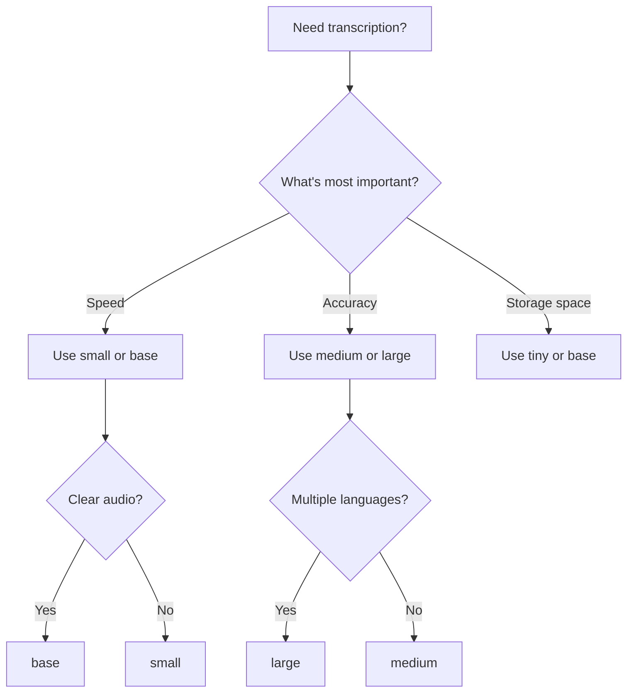

## Overview

The WhatsApp Audio Transcriber uses environment variables for configuration. All settings are defined in the `.env` file in the project root.

<Note>
  After changing any configuration, you must restart the bot for changes to take effect.
</Note>

## Environment Variables

Create a `.env` file by copying the example:

```bash
cp .env.example .env
```

Here's the complete configuration reference:

### PORT

<ParamField path="PORT" type="number" default="8080">
  The port number where the web server will listen for displaying the QR code.
</ParamField>

**Example:**
```bash
PORT=8080
```

<Info>
  The web server is used to display the WhatsApp authentication QR code. Access it at `http://localhost:PORT` after starting the bot.
</Info>

**Use cases:**
- Default `8080` works for most users
- Use a different port if `8080` is already in use
- When deploying on a server, ensure the port is open in your firewall

---

### TRANSCRIPTION_REACTION

<ParamField path="TRANSCRIPTION_REACTION" type="string" default="🤖">
  The emoji reaction that triggers transcription of a voice message.
</ParamField>

**Example:**
```bash
TRANSCRIPTION_REACTION='🤖'
```

<Tip>
  Choose an emoji that's easy to access on your keyboard and unlikely to be used accidentally.
</Tip>

**Popular alternatives:**
```bash
TRANSCRIPTION_REACTION='👂'  # Ear emoji
TRANSCRIPTION_REACTION='📝'  # Memo emoji
TRANSCRIPTION_REACTION='🎙️'  # Microphone emoji
TRANSCRIPTION_REACTION='💬'  # Speech bubble
TRANSCRIPTION_REACTION='🔊'  # Speaker emoji
```

**How it works:**
- You react to a voice message with this emoji
- The bot detects the reaction (must be from you, not others)
- The bot transcribes the audio and replies with the text
- Reactions older than 2 minutes are ignored for performance

---

### USE_GPU

<ParamField path="USE_GPU" type="boolean" default="false">
  Enable GPU acceleration for Whisper transcription.
</ParamField>

**Example:**
```bash
USE_GPU=false
```

<CardGroup cols={2}>
  <Card title="CPU Mode" icon="microchip">
    **USE_GPU=false**
    
    ✓ Works on all systems
    ✓ No special hardware required
    ✗ Slower transcription
  </Card>
  <Card title="GPU Mode" icon="bolt">
    **USE_GPU=true**
    
    ✓ Much faster transcription
    ✓ Can handle larger models
    ✗ Requires CUDA-compatible GPU
  </Card>
</CardGroup>

**Requirements for GPU mode:**
- NVIDIA GPU with CUDA support
- CUDA Toolkit installed
- cuBLAS library installed
- `smart-whisper` compiled with GPU support

<Warning>
  GPU mode requires additional setup and is only supported on systems with NVIDIA GPUs. Most users should use CPU mode.
</Warning>

**Performance comparison:**
- **CPU (medium model):** ~30-60 seconds for a 1-minute voice message
- **GPU (medium model):** ~5-10 seconds for a 1-minute voice message

---

### WHISPER_LOCAL_MODEL_PATH

<ParamField path="WHISPER_LOCAL_MODEL_PATH" type="string">
  Path to your local Whisper model file in GGML format.
</ParamField>

**Example:**
```bash
WHISPER_LOCAL_MODEL_PATH=models/ggml-large-v3.bin
```

<Info>
  This can be a relative path (from project root) or an absolute path.
</Info>

**Common configurations:**
```bash
# Relative paths
WHISPER_LOCAL_MODEL_PATH=models/ggml-tiny.bin
WHISPER_LOCAL_MODEL_PATH=models/ggml-base.bin
WHISPER_LOCAL_MODEL_PATH=models/ggml-small.bin
WHISPER_LOCAL_MODEL_PATH=models/ggml-medium.bin
WHISPER_LOCAL_MODEL_PATH=models/ggml-large-v3.bin

# Absolute path
WHISPER_LOCAL_MODEL_PATH=/home/user/whisper-models/ggml-medium.bin
```

**If the path is invalid:**
- The bot will fall back to `WHISPER_MODEL` setting
- If `WHISPER_MODEL` is set, it will download that model automatically
- Downloaded models are cached for future use

---

### WHISPER_MODEL

<ParamField path="WHISPER_MODEL" type="string" default="medium">
  The Whisper model to download and use if `WHISPER_LOCAL_MODEL_PATH` is not found.
</ParamField>

**Example:**
```bash
WHISPER_MODEL=medium
```

**Available models:**

<Tabs>
  <Tab title="tiny">
    ```bash
    WHISPER_MODEL=tiny
    ```
    - **Size:** 75 MB
    - **Speed:** Fastest (~5-10s per minute of audio)
    - **Accuracy:** Low - frequent errors
    - **Languages:** Limited support
    - **Best for:** Testing and development only
  </Tab>
  <Tab title="base">
    ```bash
    WHISPER_MODEL=base
    ```
    - **Size:** 142 MB
    - **Speed:** Very fast (~10-20s per minute of audio)
    - **Accuracy:** Moderate - acceptable for clear audio
    - **Languages:** Good support
    - **Best for:** Quick transcriptions, resource-constrained systems
  </Tab>
  <Tab title="small">
    ```bash
    WHISPER_MODEL=small
    ```
    - **Size:** 466 MB
    - **Speed:** Fast (~20-30s per minute of audio)
    - **Accuracy:** Good - handles most accents
    - **Languages:** Very good support
    - **Best for:** General use, good balance of speed and accuracy
  </Tab>
  <Tab title="medium" default>
    ```bash
    WHISPER_MODEL=medium
    ```
    - **Size:** 1.5 GB
    - **Speed:** Moderate (~30-60s per minute of audio)
    - **Accuracy:** Very good - excellent accuracy
    - **Languages:** Excellent support for 99+ languages
    - **Best for:** **Recommended** - best balance for most users
  </Tab>
  <Tab title="large-v3">
    ```bash
    WHISPER_MODEL=large
    ```
    - **Size:** 3.1 GB
    - **Speed:** Slow (~60-120s per minute of audio)
    - **Accuracy:** Excellent - highest accuracy
    - **Languages:** Best multilingual support
    - **Best for:** Maximum accuracy, multilingual content, difficult audio
  </Tab>
</Tabs>

<Note>
  Model files are automatically downloaded on first use and cached in the `smart-whisper` package directory.
</Note>

**Choosing the right model:**



---

### TRANSCRIPTION_LANGUAGE

<ParamField path="TRANSCRIPTION_LANGUAGE" type="string" default="auto">
  The language code for transcription. Use `auto` for automatic detection.
</ParamField>

**Example:**
```bash
TRANSCRIPTION_LANGUAGE=auto
```

<Tip>
  Specifying the correct language improves accuracy by 5-15% compared to automatic detection.
</Tip>

**Common language codes:**
```bash
TRANSCRIPTION_LANGUAGE=auto   # Automatic detection (default)
TRANSCRIPTION_LANGUAGE=en     # English
TRANSCRIPTION_LANGUAGE=es     # Spanish
TRANSCRIPTION_LANGUAGE=fr     # French
TRANSCRIPTION_LANGUAGE=de     # German
TRANSCRIPTION_LANGUAGE=it     # Italian
TRANSCRIPTION_LANGUAGE=pt     # Portuguese
TRANSCRIPTION_LANGUAGE=nl     # Dutch
TRANSCRIPTION_LANGUAGE=pl     # Polish
TRANSCRIPTION_LANGUAGE=ru     # Russian
TRANSCRIPTION_LANGUAGE=zh     # Chinese
TRANSCRIPTION_LANGUAGE=ja     # Japanese
TRANSCRIPTION_LANGUAGE=ko     # Korean
TRANSCRIPTION_LANGUAGE=ar     # Arabic
TRANSCRIPTION_LANGUAGE=hi     # Hindi
TRANSCRIPTION_LANGUAGE=tr     # Turkish
```

<Accordion title="Full list of supported languages (99+)">
  Whisper supports 99+ languages including:
  
  Afrikaans (af), Arabic (ar), Armenian (hy), Azerbaijani (az), Belarusian (be), Bosnian (bs), Bulgarian (bg), Catalan (ca), Chinese (zh), Croatian (hr), Czech (cs), Danish (da), Dutch (nl), English (en), Estonian (et), Finnish (fi), French (fr), Galician (gl), German (de), Greek (el), Hebrew (he), Hindi (hi), Hungarian (hu), Icelandic (is), Indonesian (id), Italian (it), Japanese (ja), Kannada (kn), Kazakh (kk), Korean (ko), Latvian (lv), Lithuanian (lt), Macedonian (mk), Malay (ms), Marathi (mr), Maori (mi), Nepali (ne), Norwegian (no), Persian (fa), Polish (pl), Portuguese (pt), Romanian (ro), Russian (ru), Serbian (sr), Slovak (sk), Slovenian (sl), Spanish (es), Swahili (sw), Swedish (sv), Tagalog (tl), Tamil (ta), Thai (th), Turkish (tr), Ukrainian (uk), Urdu (ur), Vietnamese (vi), Welsh (cy)
</Accordion>

**When to use specific language:**
- You primarily receive voice messages in one language
- Automatic detection is making errors
- You want slightly faster transcription
- You want maximum accuracy for a specific language

**When to use auto:**
- You receive voice messages in multiple languages
- You're not sure what language to expect
- Convenience is more important than 5% accuracy gain

---

## Complete Configuration Examples

### Minimal Configuration (Recommended)

```bash .env
PORT=8080
TRANSCRIPTION_REACTION='🤖'
USE_GPU=false
WHISPER_LOCAL_MODEL_PATH=models/ggml-medium.bin
TRANSCRIPTION_LANGUAGE=auto
```

This is the recommended starting configuration for most users.

### High-Accuracy Configuration

```bash .env
PORT=8080
TRANSCRIPTION_REACTION='📝'
USE_GPU=false
WHISPER_LOCAL_MODEL_PATH=models/ggml-large-v3.bin
TRANSCRIPTION_LANGUAGE=en
```

For maximum accuracy when transcribing English voice messages.

### Fast Configuration

```bash .env
PORT=8080
TRANSCRIPTION_REACTION='🤖'
USE_GPU=false
WHISPER_LOCAL_MODEL_PATH=models/ggml-small.bin
TRANSCRIPTION_LANGUAGE=auto
```

For faster transcription on systems with limited resources.

### GPU-Accelerated Configuration

```bash .env
PORT=8080
TRANSCRIPTION_REACTION='🤖'
USE_GPU=true
WHISPER_LOCAL_MODEL_PATH=models/ggml-large-v3.bin
TRANSCRIPTION_LANGUAGE=auto
```

For maximum speed and accuracy on systems with NVIDIA GPUs.

### Multilingual Configuration

```bash .env
PORT=8080
TRANSCRIPTION_REACTION='🌍'
USE_GPU=false
WHISPER_LOCAL_MODEL_PATH=models/ggml-large-v3.bin
TRANSCRIPTION_LANGUAGE=auto
```

For handling voice messages in many different languages.

## Verifying Configuration

After configuring your `.env` file, verify the settings:

```bash
# Display current configuration
cat .env

# Check if model file exists
ls -lh models/

# Verify model file size (should match expected size)
du -h models/ggml-*.bin
```

## Configuration Best Practices

<CardGroup cols={2}>
  <Card title="Start with defaults" icon="gauge">
    Use the recommended medium model and auto language detection initially.
  </Card>
  <Card title="Test before optimizing" icon="flask">
    Try the bot with default settings before tweaking for performance.
  </Card>
  <Card title="Monitor performance" icon="chart-line">
    Track transcription time and accuracy to guide optimization.
  </Card>
  <Card title="Don't over-configure" icon="triangle-exclamation">
    More settings don't always mean better results. Keep it simple.
  </Card>
</CardGroup>

## Troubleshooting Configuration

<AccordionGroup>
  <Accordion title="Bot doesn't respond to reactions">
    **Check:**
    1. Verify `TRANSCRIPTION_REACTION` matches the emoji you're using
    2. Ensure you're reacting to voice messages (PTT), not regular audio files
    3. Confirm reactions are less than 2 minutes old
    4. Make sure you're reacting from your own WhatsApp (not someone else)
  </Accordion>

  <Accordion title="Transcription is slow">
    **Solutions:**
    1. Use a smaller model (`small` or `base`)
    2. Enable GPU acceleration if you have an NVIDIA GPU
    3. Ensure no other heavy processes are running
    4. Consider upgrading your hardware
  </Accordion>

  <Accordion title="Transcription is inaccurate">
    **Solutions:**
    1. Use a larger model (`medium` or `large`)
    2. Specify the language instead of using `auto`
    3. Ensure audio quality is good (not too noisy or quiet)
    4. Check that you're using a GGML model file, not another format
  </Accordion>

  <Accordion title="Port already in use">
    **Solutions:**
    1. Change `PORT` to a different number (e.g., 8081, 3000)
    2. Find and kill the process using the port:
    ```bash
    # On Linux/macOS
    lsof -ti:8080 | xargs kill -9
    
    # On Windows
    netstat -ano | findstr :8080
    taskkill /PID <PID> /F
    ```
  </Accordion>
</AccordionGroup>

## Next Steps

<CardGroup cols={2}>
  <Card title="Usage Guide" icon="play" href="/guides/usage">
    Learn how to start the bot and transcribe voice messages
  </Card>
  <Card title="Installation" icon="download" href="/guides/installation">
    Go back to installation instructions
  </Card>
</CardGroup>
