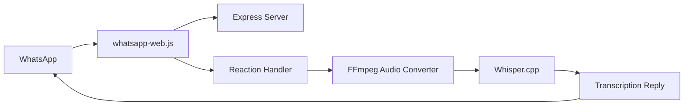

## What is WhatsApp Audio Transcriber?

WhatsApp Audio Transcriber is a Node.js bot that automatically transcribes voice messages in WhatsApp using OpenAI's Whisper model. Simply react to any voice message with a 🤖 emoji, and the bot will reply with the transcribed text.

<CardGroup cols={2}>
  <Card title="Automatic Transcription" icon="microphone">
    Convert voice messages to text with high accuracy using Whisper AI
  </Card>
  <Card title="Easy to Use" icon="hand-pointer">
    Just react to a voice message with 🤖 to get the transcription
  </Card>
  <Card title="Self-Hosted" icon="server">
    Run on your own infrastructure with full control over your data
  </Card>
  <Card title="Multi-Language" icon="globe">
    Supports automatic language detection and multiple languages
  </Card>
</CardGroup>

## Key Features

- **Seamless Integration**: Works directly with your WhatsApp account through WhatsApp Web
- **Privacy-Focused**: All processing happens locally on your machine
- **Customizable**: Configure reaction emoji, language, and model size
- **Efficient**: Uses whisper.cpp for fast, optimized transcription
- **GPU Support**: Optional GPU acceleration for faster processing

## Use Cases

<AccordionGroup>
  <Accordion title="Accessibility">
    Make voice messages accessible to deaf and hard-of-hearing users by automatically providing text transcriptions.
  </Accordion>
  <Accordion title="Content Archival">
    Keep searchable text records of important voice messages for documentation and reference.
  </Accordion>
  <Accordion title="Multilingual Communication">
    Transcribe voice messages in their original language, making it easier to translate or understand foreign languages.
  </Accordion>
  <Accordion title="Quick Reference">
    Quickly scan voice message content without needing to listen to the entire audio.
  </Accordion>
</AccordionGroup>

## How It Works

The bot uses a simple and elegant architecture:

<Steps>
  <Step title="WhatsApp Web Connection">
    The bot connects to WhatsApp Web using [whatsapp-web.js](https://github.com/pedroslopez/whatsapp-web.js), which uses Puppeteer to interact with WhatsApp through the browser.
  </Step>
  <Step title="Reaction Detection">
    When you react to a voice message with the configured emoji (default: 🤖), the bot detects the reaction event.
  </Step>
  <Step title="Audio Processing">
    The voice message is downloaded, converted from OGG to WAV format using FFmpeg, and prepared for transcription.
  </Step>
  <Step title="Whisper Transcription">
    The audio is processed by [whisper.cpp](https://github.com/ggerganov/whisper.cpp) through the [smart-whisper](https://github.com/JacobLinCool/smart-whisper) wrapper to generate the transcription.
  </Step>
  <Step title="Reply">
    The transcribed text is sent as a reply to the original voice message.
  </Step>
</Steps>

## Architecture Overview

## Prerequisites

Before you begin, ensure you have the following installed:

<CardGroup cols={2}>
  <Card title="Node.js" icon="node-js">
    Version 18 or higher recommended
  </Card>
  <Card title="FFmpeg" icon="film">
    Required for audio format conversion
  </Card>
  <Card title="WhatsApp Account" icon="whatsapp">
    An active WhatsApp account with WhatsApp Web access
  </Card>
  <Card title="Storage Space" icon="hard-drive">
    At least 2GB free for the Whisper model
  </Card>
</CardGroup>

<Note>
  The bot runs locally on your machine and requires your WhatsApp account to remain authenticated. It does not store or transmit your messages to any external servers.
</Note>

## Technology Stack

The project is built with:

- **whatsapp-web.js**: WhatsApp API client using Puppeteer
- **smart-whisper**: Node.js wrapper for whisper.cpp
- **FFmpeg**: Audio format conversion
- **Express**: Web server for QR code authentication
- **TypeScript**: Type-safe development

## Next Steps

Ready to get started? Follow our [quickstart guide](/quickstart) to set up the bot and transcribe your first voice message in just a few minutes.
