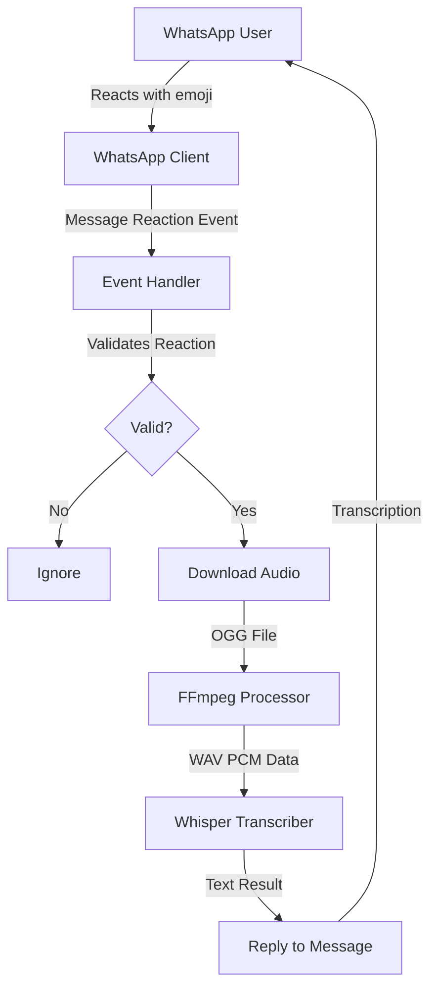

This page provides a comprehensive overview of the WhatsApp Audio Transcriber's architecture, components, and data flow.

## System Overview

WhatsApp Audio Transcriber is a Node.js application that automatically transcribes WhatsApp voice messages using OpenAI's Whisper model. The system monitors for message reactions and processes voice messages through an audio transcription pipeline.



## Core Components

The application consists of five main components that work together to provide seamless voice message transcription.

<Card title="Express Server" icon="server" href="#express-server">
  Provides a web interface for QR code authentication and monitors application health.
</Card>

<Card title="WhatsApp Client" icon="whatsapp" href="#whatsapp-client">
  Handles WhatsApp Web connection, authentication, and message event monitoring.
</Card>

<Card title="Event Handler" icon="bolt" href="#message-reaction-handler">
  Processes message reaction events and triggers the transcription pipeline.
</Card>

<Card title="Audio Processor" icon="waveform" href="#audio-processing-pipeline">
  Converts voice messages from OGG to WAV format using FFmpeg.
</Card>

<Card title="Whisper Transcriber" icon="microphone" href="#whisper-transcription">
  Performs speech-to-text conversion using the Whisper model.
</Card>

## Express Server

The Express server provides a minimal HTTP interface for QR code authentication during initial setup.

**Implementation** (`src/index.ts:38-55`):

```typescript
const app = express();

app.get('/', async (req, res) => {
    return client.getState().then((state) => {
        if (state === 'CONNECTED') {
            return res.send('Connected. You can close this page.');
        }  else if (qrCode) {
            return res.send(``);
        }
        return res.send('QR code not available yet. Refresh the page.');
    }).catch((error) => {
        console.error(error);
        return res.send('QR code not available yet. Refresh the page.');
    });
});

app.listen(port);
```

**Features:**
- Single route (`/`) that displays the QR code or connection status
- Automatically updates based on WhatsApp client state
- Listens on configurable port (default: 8080)
- Simple HTML response with embedded QR code image

<Note>
  The server uses a TODO comment indicating future enhancement to implement Server-Sent Events (SSE) for real-time QR code updates without page refresh.
</Note>

## WhatsApp Client

The WhatsApp client is built using `whatsapp-web.js`, which provides a programmatic interface to WhatsApp Web.

**Configuration** (`src/index.ts:57-68`):

```typescript
const client = new Client({
    authStrategy: new LocalAuth(),
    puppeteer: {
        args: [
            '--no-sandbox'
        ],
    },
    webVersionCache: {
        type: 'remote',
        remotePath: 'https://raw.githubusercontent.com/wppconnect-team/wa-version/main/html/2.2410.1.html'
    }
});
```

**Key Configuration Options:**

<ParamField path="authStrategy" type="LocalAuth">
  Uses local authentication to persist session data, avoiding repeated QR code scans.
</ParamField>

<ParamField path="puppeteer.args" type="array">
  Includes `--no-sandbox` flag for compatibility with Docker and restricted environments.
</ParamField>

<ParamField path="webVersionCache" type="object">
  Uses a remote cached version of WhatsApp Web to ensure compatibility and stability.
</ParamField>

**QR Code Generation** (`src/index.ts:70-72`):

```typescript
client.on('qr', async (qrCodeData) => {
    qrCode = await QRCode.toDataURL(qrCodeData);
});
```

The client converts QR code data to a Data URL for easy display in the web interface.

## Message Reaction Handler

The core logic of the application is triggered by the `message_reaction` event, which fires whenever someone reacts to a message.

**Event Listener** (`src/index.ts:74-81`):

```typescript
client.on('message_reaction', async reaction => {
    if (
        !reaction.id.fromMe || 
        reaction.reaction !== transcriptionReaction || 
        moment.unix(reaction.timestamp).isBefore(moment().subtract(2, 'minutes'))
    ) {
        return;
    }
    // ... transcription logic
});
```

**Validation Rules:**

1. **Self-reactions only** (`reaction.id.fromMe`): Only processes reactions added by the bot owner
2. **Correct emoji** (`reaction.reaction !== transcriptionReaction`): Matches the configured emoji (default: 🤖)
3. **Recent reactions** (within 2 minutes): Prevents processing old reactions on startup

<Warning>
  The 2-minute window prevents the bot from attempting to transcribe potentially hundreds of old reactions when restarting. Adjust this value in the code if needed.
</Warning>

**Message Retrieval** (`src/index.ts:83-96`):

```typescript
var message: WAWebJS.Message | undefined;
var numberOfTries = 0;

while (numberOfTries < 30) {
    try {
        message = await client.getMessageById(reaction.msgId._serialized);
        break;
    } catch (error) {
        console.log(error);
        numberOfTries++;
        await new Promise(resolve => setTimeout(resolve, 2000));
    }
}
```

**Retry Logic:**
- Attempts to retrieve the message up to 30 times
- Waits 2 seconds between each attempt
- Maximum wait time: 60 seconds (30 attempts × 2 seconds)
- Handles race conditions where reactions arrive before messages

<Info>
  This retry mechanism is crucial for handling WhatsApp's eventual consistency model, where reactions can sometimes arrive before the associated message is fully synced.
</Info>

## Audio Processing Pipeline

Once a valid voice message (`ptt` - Push To Talk) is identified, it goes through a multi-step audio processing pipeline.

### Step 1: Media Download

```typescript
if (whisper && message?.type === 'ptt') {
    const audio = await message.downloadMedia();
    const filePathWithoutExtension = `./tmp/audio/${Date.now()}`;
    fs.writeFileSync(`${filePathWithoutExtension}.ogg`, audio.data, 'base64');
```

- Downloads the voice message as base64-encoded OGG data
- Creates unique filename using current timestamp
- Saves to `./tmp/audio/` directory (created at startup on line 34)

### Step 2: FFmpeg Conversion

```typescript
ffmpeg(`${filePathWithoutExtension}.ogg`)
    .audioFrequency(16000)
    .toFormat('wav')
    .save(`${filePathWithoutExtension}.wav`)
    .on('end', async () => {
        // ... transcription logic
    });
```

**Conversion Parameters:**

<ParamField path="audioFrequency" type="16000 Hz">
  Converts audio to 16kHz sample rate, which is the standard input format for Whisper models.
</ParamField>

<ParamField path="toFormat" type="wav">
  Converts from OGG (Opus codec) to WAV (uncompressed PCM) format.
</ParamField>

### Step 3: PCM Extraction

```typescript
const { channelData } = decode(fs.readFileSync(`${filePathWithoutExtension}.wav`));
const pcm = channelData[0];
fs.unlinkSync(`${filePathWithoutExtension}.ogg`);
fs.unlinkSync(`${filePathWithoutExtension}.wav`);
```

- Decodes WAV file to extract PCM (Pulse Code Modulation) data
- Takes first channel (mono audio) from `channelData`
- Cleans up temporary OGG and WAV files to save disk space

<Note>
  The temporary files are created in `./tmp/audio/` which is initialized at startup with `fs.mkdirSync('./tmp/audio/', { recursive: true })` on line 34.
</Note>

## Whisper Transcription

The Whisper component handles model initialization and performs the actual speech-to-text transcription.

### Model Initialization

**Startup Logic** (`src/index.ts:19-32`):

```typescript
const whisperOptions = {
    gpu: useGPU
};

var whisper: Whisper;
if (whisperLocalModelPath && fs.existsSync(whisperLocalModelPath)) {
    whisper = new Whisper(whisperLocalModelPath, whisperOptions);
} else if (manager.check(whisperModel)) {
    whisper = new Whisper(manager.resolve(whisperModel), whisperOptions);
} else {
    manager.download(whisperModel).then(() => {
        whisper = new Whisper(manager.resolve(whisperModel), whisperOptions);
    });
}
```

**Initialization Priority:**

1. **Local model path**: If `WHISPER_LOCAL_MODEL_PATH` is set and file exists
2. **Cached model**: If the model specified in `WHISPER_MODEL` is already downloaded
3. **Download model**: Downloads the model asynchronously if not available

<Warning>
  If the model needs to be downloaded, transcription will not work until the download completes. For large models (e.g., `large-v3`), this can take several minutes depending on your internet connection.
</Warning>

### Transcription Execution

```typescript
const task = await whisper.transcribe(pcm, { language: transcriptionLanguage });
const transcription = (await task.result).map((result) => result.text).join(' ');
if (transcription) {
    message!.reply(`[WA-TRANSCRIBER-BOT] ${transcription}`);
}
```

**Process Flow:**

1. **Transcribe**: Processes PCM audio data with specified language
2. **Extract text**: Maps result objects to text strings and joins them
3. **Reply**: Sends transcription as a reply to the original voice message

**Response Format:**
```
[WA-TRANSCRIBER-BOT] This is the transcribed text from the voice message.
```

## Data Flow Diagram

Here's a complete end-to-end data flow from user interaction to transcription:

```
1. User reacts to voice message with 🤖
   ↓
2. WhatsApp sends message_reaction event
   ↓
3. Event handler validates:
   - Reaction is from bot owner
   - Reaction emoji matches configuration
   - Reaction is less than 2 minutes old
   ↓
4. Retry loop retrieves message (up to 30 attempts)
   ↓
5. Check if message type is 'ptt' (voice message)
   ↓
6. Download voice message as base64 OGG
   ↓
7. Save OGG file to ./tmp/audio/{timestamp}.ogg
   ↓
8. FFmpeg converts OGG → WAV (16kHz)
   ↓
9. Extract PCM data from WAV file
   ↓
10. Delete temporary OGG and WAV files
    ↓
11. Whisper transcribes PCM → text
    ↓
12. Bot replies to original message with transcription
    ↓
13. User receives transcription in WhatsApp
```

## File Structure

The project follows a simple, focused structure:

```
whatsapp-audio-transcriber/
├── src/
│   └── index.ts          # Main application file (all logic)
├── tmp/
│   └── audio/            # Temporary storage for audio files
├── .wwebjs_auth/         # WhatsApp session data (auto-generated)
├── models/               # Optional: Local Whisper models
├── .env                  # Environment configuration
├── .env.example          # Environment template
├── package.json          # Dependencies and scripts
└── tsconfig.json         # TypeScript configuration
```

<Info>
  The entire application logic is contained in a single file (`src/index.ts` - 121 lines), making it easy to understand and modify.
</Info>

## Dependencies

The application relies on several key dependencies, each serving a specific purpose:

### Core Dependencies

<Accordion title="whatsapp-web.js (^1.23.0)">
  **Purpose:** WhatsApp Web API client
  
  **Usage:**
  - Manages WhatsApp connection and authentication
  - Handles message and reaction events
  - Provides message download and reply functionality
  
  **Implementation:**
  ```typescript
  import WAWebJS, { Client, LocalAuth } from 'whatsapp-web.js';
  const client = new Client({ authStrategy: new LocalAuth() });
  ```
</Accordion>

<Accordion title="smart-whisper (^0.7.0)">
  **Purpose:** Node.js bindings for whisper.cpp
  
  **Usage:**
  - Manages Whisper model downloads
  - Performs speech-to-text transcription
  - Supports CPU and GPU inference
  
  **Implementation:**
  ```typescript
  import { Whisper, manager } from "smart-whisper";
  const whisper = new Whisper(manager.resolve('medium'), { gpu: false });
  ```
</Accordion>

<Accordion title="fluent-ffmpeg (^2.1.3)">
  **Purpose:** FFmpeg wrapper for audio conversion
  
  **Usage:**
  - Converts OGG to WAV format
  - Resamples audio to 16kHz
  - Provides fluent API for audio processing
  
  **Implementation:**
  ```typescript
  import ffmpeg from 'fluent-ffmpeg';
  ffmpeg('input.ogg').audioFrequency(16000).toFormat('wav').save('output.wav');
  ```
</Accordion>

<Accordion title="node-wav (^0.0.2)">
  **Purpose:** WAV file decoder
  
  **Usage:**
  - Decodes WAV files to PCM data
  - Extracts audio channel data for Whisper
  
  **Implementation:**
  ```typescript
  import { decode } from 'node-wav';
  const { channelData } = decode(fs.readFileSync('audio.wav'));
  ```
</Accordion>

<Accordion title="express (^4.18.2)">
  **Purpose:** HTTP server framework
  
  **Usage:**
  - Serves QR code web interface
  - Displays connection status
  
  **Implementation:**
  ```typescript
  import express from 'express';
  const app = express();
  app.get('/', (req, res) => res.send(''));
  ```
</Accordion>

<Accordion title="qrcode (^1.5.3)">
  **Purpose:** QR code generation
  
  **Usage:**
  - Converts WhatsApp QR data to Data URL
  - Enables display in web browser
  
  **Implementation:**
  ```typescript
  import QRCode from 'qrcode';
  const qrCode = await QRCode.toDataURL(qrCodeData);
  ```
</Accordion>

<Accordion title="moment (^2.30.1)">
  **Purpose:** Date/time manipulation
  
  **Usage:**
  - Filters reactions older than 2 minutes
  - Timestamp comparison and validation
  
  **Implementation:**
  ```typescript
  import moment from 'moment';
  moment.unix(timestamp).isBefore(moment().subtract(2, 'minutes'))
  ```
</Accordion>

<Accordion title="dotenv (^16.3.1)">
  **Purpose:** Environment variable management
  
  **Usage:**
  - Loads variables from `.env` file
  - Provides configuration at runtime
  
  **Implementation:**
  ```typescript
  import { config } from 'dotenv';
  config();
  const port = process.env.PORT || 8080;
  ```
</Accordion>

## Technical Implementation Details

### Temporary File Management

The application creates a `./tmp/audio/` directory at startup for storing temporary audio files:

```typescript
fs.mkdirSync('./tmp/audio', { recursive: true });
```

**Cleanup Strategy:**
- Files are deleted immediately after PCM extraction
- Unique timestamps prevent filename collisions
- No manual cleanup required

### Error Handling

The application implements basic error handling for message retrieval:

```typescript
try {
    message = await client.getMessageById(reaction.msgId._serialized);
    break;
} catch (error) {
    console.log(error);
    numberOfTries++;
    await new Promise(resolve => setTimeout(resolve, 2000));
}
```

**Limitations:**
- No error handling for FFmpeg conversion failures
- No error handling for Whisper transcription failures
- Silent failures may occur for invalid audio formats

<Warning>
  Production deployments should add try-catch blocks around the FFmpeg and Whisper operations to handle edge cases gracefully.
</Warning>

### Performance Considerations

**Model Loading:**
- Models are loaded once at startup and kept in memory
- Large models (e.g., `large-v3`) require ~10GB RAM
- GPU acceleration significantly improves speed (3-5x faster)

**Audio Processing:**
- FFmpeg conversion is fast (~100-500ms for typical voice messages)
- Whisper transcription time depends on model size and audio length
- Approximate times for 30-second voice message:
  - `tiny`: 1-2 seconds (CPU)
  - `medium`: 5-10 seconds (CPU)
  - `large`: 15-30 seconds (CPU)
  - Any model with GPU: 1-5 seconds

**Concurrency:**
- The application processes reactions sequentially
- Multiple simultaneous reactions may cause queue buildup
- No rate limiting or queue management implemented

### Security Considerations

**Authentication:**
- WhatsApp session is stored in `.wwebjs_auth/` directory
- Contains sensitive authentication tokens
- Should not be committed to version control

**Reaction Validation:**
- Only self-reactions trigger transcription (`fromMe: true`)
- Prevents unauthorized users from triggering transcription
- 2-minute window prevents replay attacks

**File System:**
- Temporary files use timestamp-based names
- Files are deleted after processing
- No user-controlled file paths (prevents path traversal)

<Note>
  The `--no-sandbox` Puppeteer flag reduces security but is necessary for Docker deployments. Remove this flag if running in a trusted environment outside of containers.
</Note>

## Future Enhancements

The codebase includes a TODO comment indicating planned improvements:

```typescript
// TODO: Use Server-Sent Events (SSE) to update the QR code in real-time
```

Other potential enhancements:
- WebSocket support for real-time QR code updates
- Queue management for concurrent transcriptions
- Comprehensive error handling and logging
- Support for group chats and multiple users
- Database storage for transcription history
- API endpoints for transcription status
